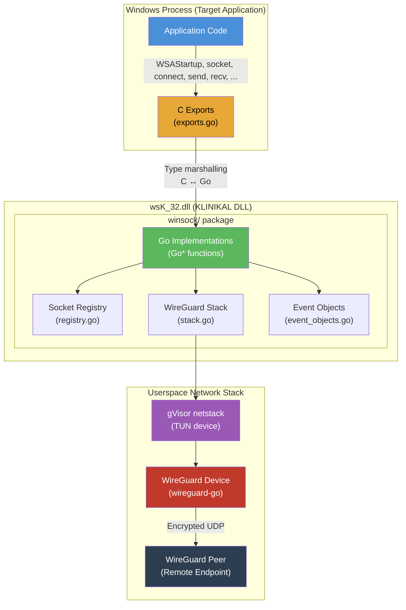
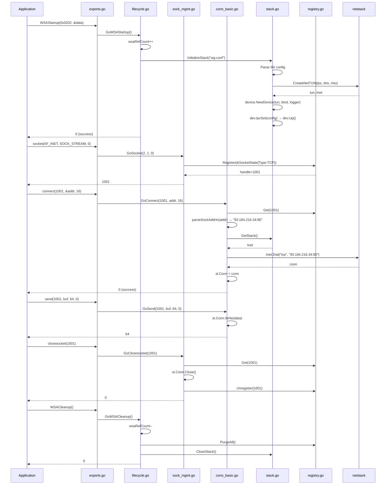

# KLINIKAL
WINSOCK2 TO WIREGUARD PROXY DLL
---
KLINIKAL is a Go-based userspace Winsock2 DLL drop-in replacement that transparently tunnels all Windows socket API calls through a WireGuard VPN using an in-process network stack. It cross-compiles from Linux to a Windows DLL via cgo and MinGW, exporting 100+ functions with byte-compatible C signatures matching winsock2.h and ws2tcpip.h. Any Windows application that loads this DLL instead of the system ws2_32.dll will have its entire network I/O silently routed through the configured WireGuard tunnel — without drivers, adapters, or elevated privileges.

## BUILDING
See the `Dockerfile`

## USAGE

See the demo folder.  
Due to `ws2_32.dll` being a protected system dll, it cannot simply be replaced by putting the dll next to the application.  
The application would have to call LoadLibrary itself on a renamed dll if used in your own project, or like in the demo, resolve the IAT by manually mapping the dll itself (ie through injection) for use in an existing executable.

## ARCHITECTURE
### High-Level Design

#### Socket Lifecycle

